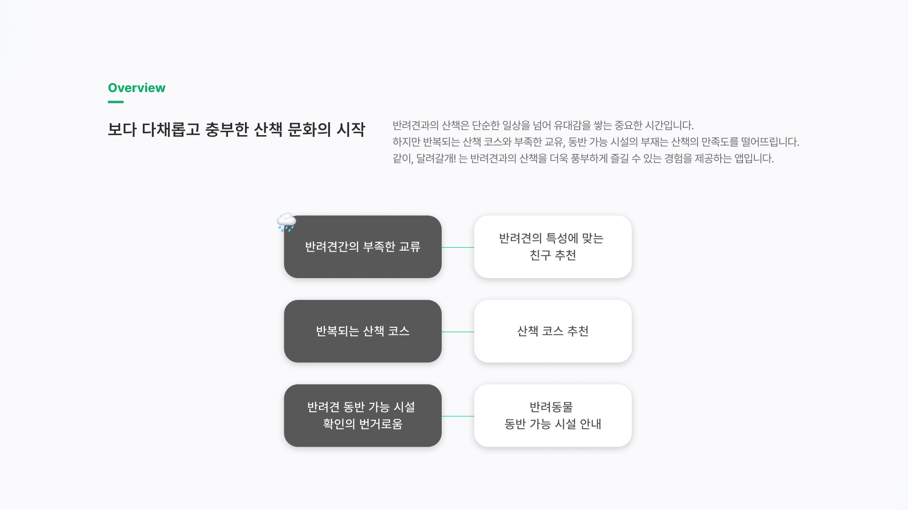
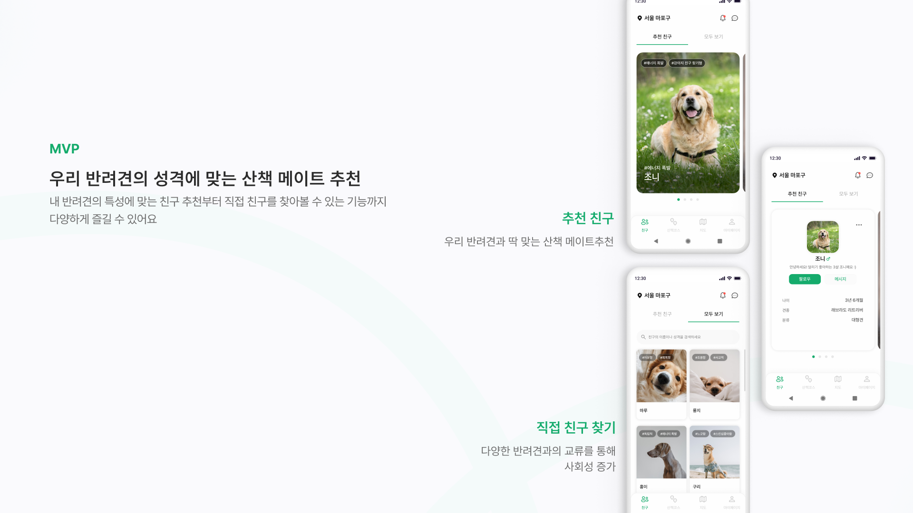
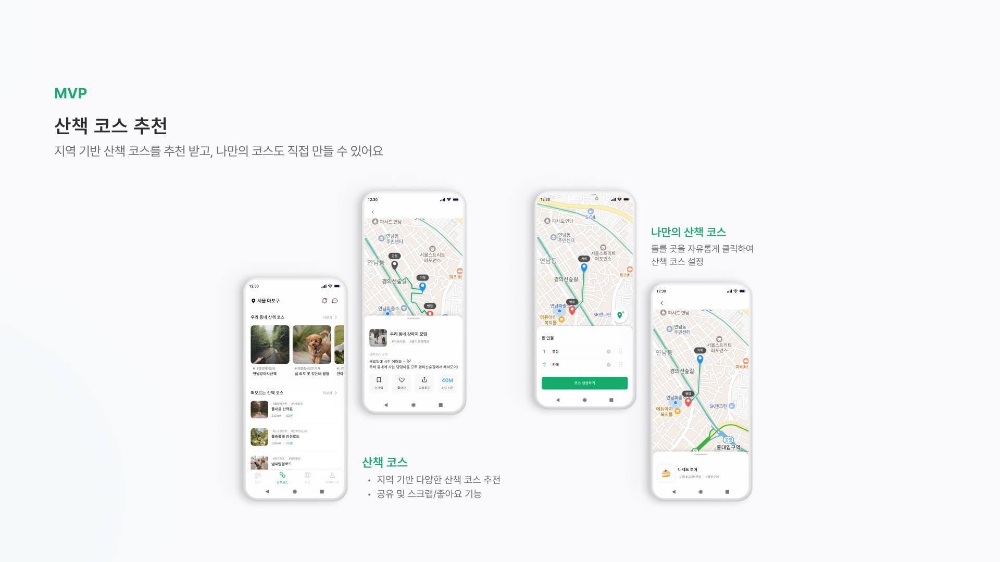
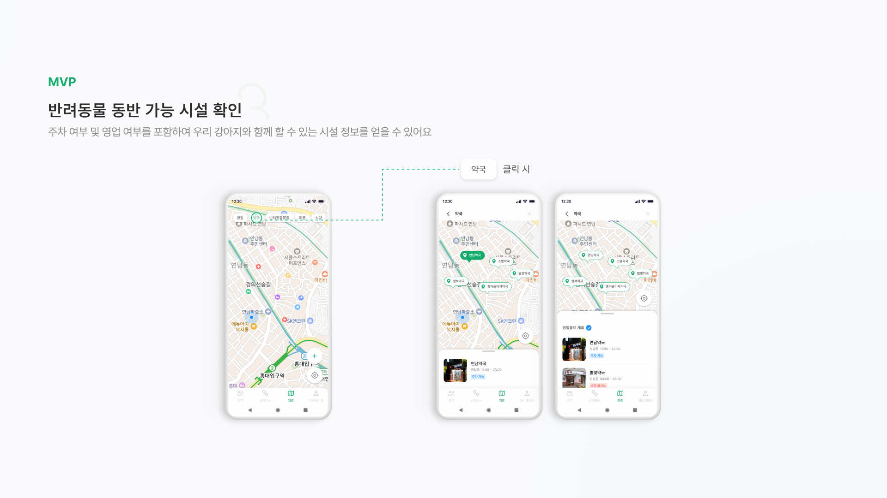
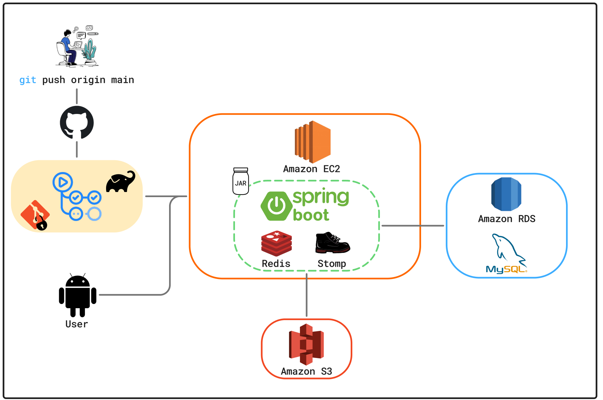

# 같이, 달려갈개 ! : 지역 기반 반려견 산책 메이트 [ BE ]

## 🚀 프로젝트 소개

- [같이, 달려갈개!] 는 반려견 산책 친구 및 산책 코스 추천을 통해 반려견과 더 즐거운 시간을 보낼 수 있도록 돕는 어플리케이션입니다.

### 🌟 핵심 기능

- 국토교통부 자료를 통한 지역 변경 시스템 구현
- 산책 스타일이 비슷한 반려견과 매칭
- Redis Pub/Sub을 활용한 타 사용자와 실시간 채팅 서비스
- DTO Projection 과 페이징을 활용한 조회 로직 최적화

- 온보딩 시 저장된 산책 스타일을 기반으로 산책 코스 추천
- 사용자 지정 핀을 통한 산책 코스 저장 및 제작 기능
- 사용자 지정 핀과 최적 경로에 대한 효율적인 저장

- 공공데이터포털의 CSV 데이터를 사용하여 파싱 및 활용

## 🧱 프로젝트 구조 및 스택

### 🛰️ 서버 아키텍쳐

### ✨ 사용 기술 스택

### 🧑‍💻 팀원 소개 (BE Team)

| [김석현 (TL)](https://github.com/jijysun) | [황서진](https://github.com/HwangSeo) | [문지현](https://github.com/dxxrjh) | [장예린](https://github.com/yelin1197) | [김수민](https://github.com/sooominie) |
|:--------------------------------------:|:----------------------------------:|:--------------------------------:|:-----------------------------------:|:-----------------------------------:|
|               **채팅 서비스**               |        **사용자, 온보딩, 마이페이지**         |         **친구, 산책코스, 공통**         |          **지도, 반려견 동반 시설**          |          **지도, 반려견 동반 시설**          |